# 📈 Projektin kehityshistoria ja järjestelmäarkkitehtuuri

Tämä dokumentti kuvaa pörssisähköjärjestelmän kehitysmatkan ensimmäisistä prototyypeistä nykyiseen versioon (v2.2).

---

## 🗺️ Kehitysvaiheet kronologisesti

Alkutilanne
Projektissa rakennetaan paikallinen älykoti järjestelmä hyödyntämällä Home Assistant -alustaa ja kierrätettyä PC-laitteistoa.

[`Home assistant järjestelmän asentaminen`](documents/Home%20assist%20asentaminen.docx)

komponettienvalinta
Projektiin valittiin Philips Hue aloituspaketti, jossa on Philips silta ja 3 älylamppua. Lisäksi hankittiin 2 Philips älypistoketta.

🔍 komponentit
 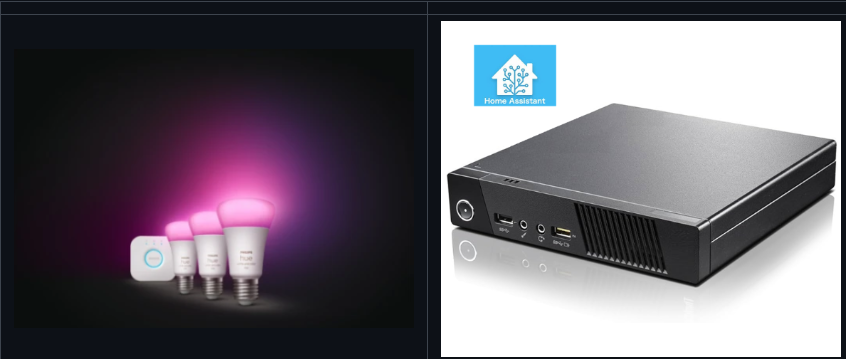

### Vaihe 1: Ensimmäiset askeleet (Älylampputestit)
Projekti käynnistyi hyvin yksinkertaisella kokeilulla. Tavoitteena oli oppia Home Assistantin automaatioiden perusteet ja testata laitteiden reaaliaikaista ohjausta:
*   **Ensimmäinen testi:** Luotiin automaatio, joka ohjasi älylamppua sekä älypistoketta (on/off) (päällä 1 min pois 1 min) .
*   **Väriohjaus:** Laajennettiin automaatiota muuttamaan älylampun väriä lennosta, millä testattiin monimutkaisempien komentojen ja datapakettien kulkua Zigbee/Wi-Fi-verkoissa.

🔍 verkko
 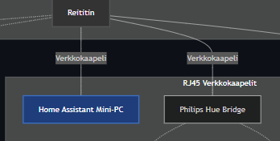

### Vaihe 2: Nordpool-integraatio ja visuaalinen hintavahti
Kun perusohjaus toimi, järjestelmään kytkettiin **Nordpool-sensori** reaaliaikaisten pörssisähköhintojen noutamiseksi:
*   Luotiin automaatio, joka vertasi kuluvan jakson hintaa vuorokauden min/max hintaan.
*   Älylamppu muutettiin visuaaliseksi hintavahdiksi kodin seinälle: lamppu paloi **vihreänä**, kun sähkö oli halpaa, ja muuttui **keltaisen**, **oranssin** kautta **punaiseksi**, kun hinta nousi kalliiksi.

🔍 nordpool
 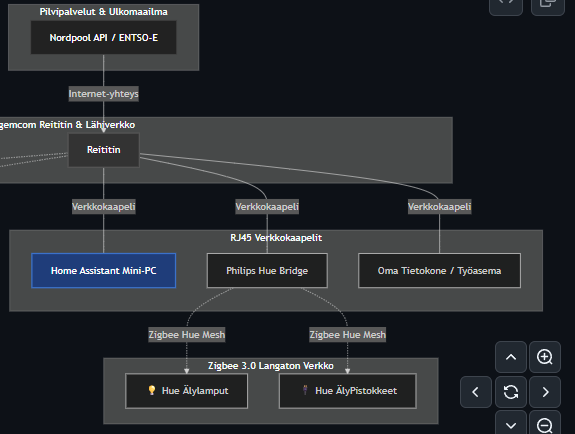

### Vaihe 3: Älypistokkeet ja ensimmäiset käyttöliittymät (The Grid)
Visuaalisesta vahdista siirryttiin todelliseen kuormanohjaukseen, kun järjestelmään liitettiin ensimmäiset WiZ-älypistokkeet:
*   **Käyttöliittymän synty:** Rakennettiin ensimmäiset Lovelace-dashboardit laitteiden ohjaukseen.
*   **The Grid (Ruudukko):** Kehitettiin dynaaminen tuntiruudukko, josta käyttäjä pystyi itse klikkailemalla valitsemaan (Grid-valinnat), mitkä jaksot laitteet olivat päällä ja mitkä pois.

🔍 Grid
 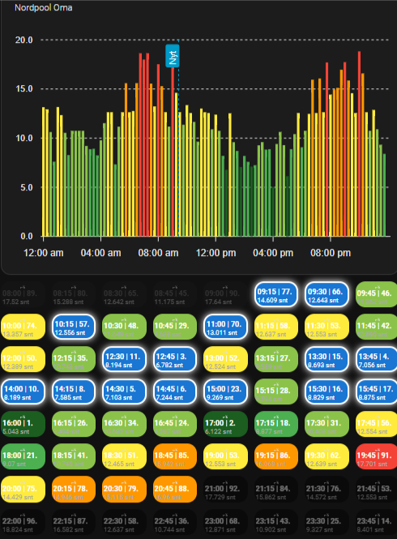

### Vaihe 4: Oletusasetukset ja Raportit
Wiz pistokkeiden avulla saatiin mitattua todellinen. Latausteho älylampuilla oli lähellä 0W. Pistokkeille lisättiin oletusasetukset, josta voi lisätä latauskuormaa.

🔍 oletusasetukset
 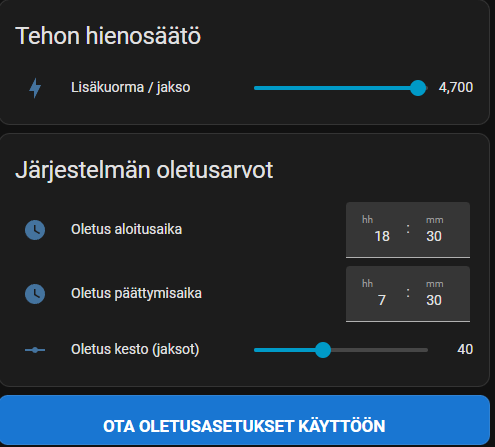

🔍 näytä lataus valmis raportti
 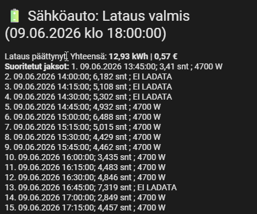

### Vaihe 5: Testauskaaos (61 automaatiota ja muistirajoitukset)
Toiminnallisuuksien kasvaessa (kestoasetukset, optimaalisten jaksojen haut, simulaatiotilat, aikarajoitukset) järjestelmä monimutkaistui nopeasti. 
*   Erilaisia kokeiluja, päällekkäisiä logiikoita ja testiautomaatioita kertyi lopulta huikeat **61 kappaletta**.
*   Järjestelmä törmäsi Home Assistantin `input_text`-kenttien kiinteään **255 merkin rajoitukseen**, kun pitkien latausten tehojonoja yritettiin kirjoittaa yhteen muuttujaan. Pitkät lataukset katkesivat tai kaatuivat muistivirheisiin.

🔍 muistivirhe
 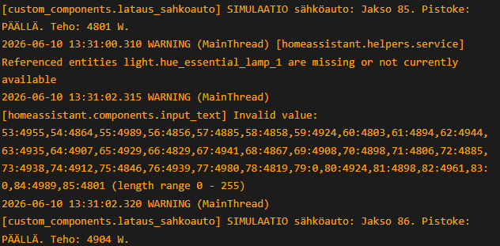

### Vaihe 6: Järjestelmän täydellinen puhdistus ja arkkitehtuurin uudistus
Havaittujen ongelmien jälkeen tehtiin radikaali päätös: koko järjestelmä pystytettiin puhtaalta pöydältä **upouudelle Home Assistant -koneelle** ja koodi kirjoitettiin kokonaan uusiksi:
*   **61 automaatiota supistettiin tasan 8 automaatioon**, jotka hoitavat kaiken taustalogiikan äärimmäisen kevyesti ja nopeasti.
*   Toteutettiin **`indeksi:teho` -paritus**, joka sitoo mitatun tehon kiinteästi jakson ID-numeroon, poistaen aikasirtymävirheet lopullisesti.
*   Kehitettiin **kaksoiskenttäarkkitehtuuri (`_part2` + `*`)**, joka halkaisee teholokit lennosta kahteen osaan pituuden ylittäessä 245 merkkiä, murtaen 255 merkin rajoituksen pysyvästi.

### Vaihe 7: Latauksen historiatietojen tallennus ja säästölaskuri
Arkkitehtuuri uudistusten jälkeen latauksen kokonaiskulutus ja hinta tallentui loppuraportteihin oikein. Kun lataus on valmis niin nyt siitä tallennettiin myös historiatiedot.

🔍 Historiatiedot
 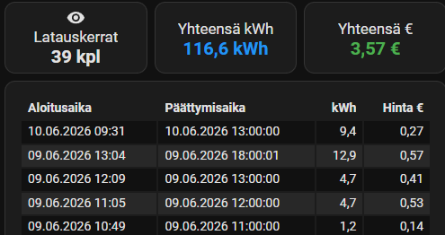

Live-kuukausisäästölaskuri: Visualisoi toteutuneet kumulatiiviset kuukausisäästöt (€) suoraan päädashboardilla verrattuna päivän keskihintaan

🔍 Live-kuukausisäästölaskuri
 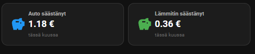

---

## 🛠️ Järjestelmän nykytila ja toiminta (Miten se toimii nyt)

Nykyinen järjestelmä on täysin tuotantovarma, automaattinen ja dynaaminen kokonaisuus, joka pyörii **8 automaation** voimin:

### Nyt käytössä olevat 8 automaatiota:
1.  **Sähköauto - [`Reaaliaikainen lataus (v1.1)`](automations/Reaaliaikainen%20lataus%20v1.1.txt):** Ohjaa fyysistä latauspistoketta sekunnilleen valitun suunnitelman mukaan.
2.  **Sähköauto - [`Latauksen simulaatio (v1.2)`](automations/Latauksen%20simulaatio%20v1.2.txt):** Mahdollistaa lataussyklien ja raportoinnin testaamisen milloin tahansa turvallisesti simuloimalla.
3.  **Lämmitin -[`Reaaliaikainen lataus (v2)`](automations/Reaaliaikainen%20lataus%20v1.1.txt):** Ohjaa lämmittimen etäpistorasiaa pörssihintojen mukaan.
4.  **Lämmitin - [`Latauksen simulaatio (v2)`](automations/Latauksen%20simulaatio%20Lämmitin.txt):** Lämmitysjärjestelmän täydellinen testaussimulaattori.
5.  **Nordpool [`Midnight Cleanup`](automations/Nordpool%20Midnight%20Cleanup%20v0.16%20AINA%20PÄÄLLÄ.txt)** Aina taustalla oleva huoltotyökalu, joka siirtää keskiyöllä huomisen luonnokset kuluvan päivän aktiivisiksi ajoiksi.
6.  **Nordpool: [`Automaattinen jaksojen haku hintojen julkaisusta`](automations/Automaattinen%20jaksojen%20haku%20hintojen%20julkaisusta%20AINA%20PÄÄLLÄ.txt)** Herää iltapäivällä (esim. klo 14:17) heti, kun huomisen pörssihinnat julkaistaan, ja laskee valmiit ehdotukset ruudukkoon oletusarvojen mukaan.
7.  **Sähköauton Latausvahti (Turvaominaisuus):** Valvoo, että virta todella kulkee, kun pistoke on päällä. (ei ole tehty)
8.  **Järjestelmän [`käynnistysvahti:`](automations/Päivitä%20jaksot%20grip%20luonnos%20automaattisesti%20AINA%20PÄÄLLÄ.txt)** Varmistaa sähkökatkon tai palvelimen uudelleenkäynnistyksen jälkeen, että käynnissä olleet lataussuunnitelmat jatkuvat automaattisesti oikeasta kohdasta.

---

## 📊 Nykyiset avainominaisuudet käytännössä

*   **Täysi automaatio iltapäivisin:** Käyttäjän ei tarvitse klikkailla kestoja tai etsiä halpoja tunteja. Automaatti laskee huomisen ehdotukset valmiiksi ruudukkoon lennosta klo 14:17, ja lähettää kännykkään push-ilmoituksen: *"Ehdotukset valmiina Dashboardilla!"*. Käyttäjälle riittää illalla vain yksi "Tallenna"-napin painallus.
*   **Puhdas automaattinen kiertokulku:** Latauksen valmistuttua aamulla järjestelmä tyhjentää Lovelace-ruudukot automaattisesti takaisin puhtaiksi (harmaiksi), jolloin Dashboard pysyy aina siistinä.
*   **Älykkäät kuukausisäästökortit:** Pääsivun yläreunassa olevat dynaamiset säästökortit vertaavat suoritettuja latauksia päivän keskihintaan ja näyttävät livenä kuluvan kuukauden säästöt euroina.
*   **Taskukokoiset loppuraportit:** Heti ajon päättyessä OnePlus-puhelin piippaa korkealla prioriteetilla tarkan yhteenvedon: *"Sähköauto ladattu: 13,01 kWh | 0,05 €"*.

## 🌐 Järjestelmän verkkorakenne (Network Architecture)

Alla oleva kaavio kuvaa, miten pörssisähködata haetaan internetistä ja miten kodin älylaitteet, sillat sekä palvelin on kytketty fyysisesti **Sagemcom-reitittimen** muodostamaan lähiverkkoon (LAN/WLAN).

### 📋 Verkkorakenteen tarkempi kuvaus
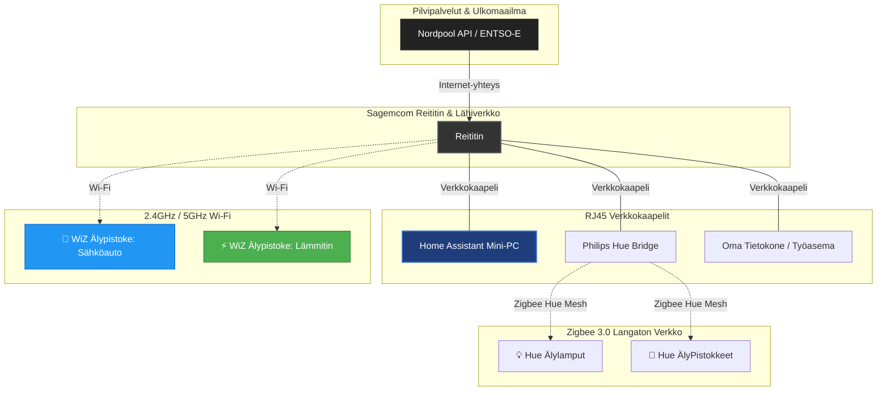

1.  **Internet & Pörssisähkö (WAN):** Sagemcom-reititin hakee internet-yhteyden yli huomisen ja tämän päivän pörssisähköhinnat. Data on peräisin virallisesta **ENTSO-E** (*European Network of Transmission System Operators for Electricity*) -rajapinnasta. ENTSO-E on Euroopan kantaverkkohaltijoiden (kuten Suomen **Fingridin**) yhteistyöjärjestö, joka julkaisee viralliset ja standardoidut pörssihinnat koko Euroopan alueelle. Home Assistantin Nordpool-integraatio lukee tätä luotettavaa, suoraa tukkumarkkinadataa livenä vuorokauden ympäri.

2.  **Sagemcom-reititin (LAN-keskiö):** Toimii kodin verkon sydämenä ja jakaa IP-osoitteet laitteille. Reitittimeen on kytketty kiinteästi **RJ45-verkkokaapeleilla** kolme kriittistä laitetta korkean vakauden ja olemattoman viiveen takaamiseksi:
    *   **Home Assistant Server (Mini-PC):** Järjestelmän aivot, joka pyörittää automaatioita ja sensoreita.
    *   **Philips Hue -silta (Bridge):** Ohjaa kodin älyvalaistusta omassa eristetyssä Zigbee-verkossaan.
    *   **Oma tietokone:** Käytetään koodaukseen, järjestelmän hallintaan ja Dashboardien muokkaamiseen.

3.  **Wi-Fi-laitteet (WLAN):** Sagemcom-reitittimen langattomaan 2.4 GHz Wi-Fi-verkkoon on kytketty molemmat suuren kuorman **WiZ-älypistokkeet** (Sähköauto ja Lämmitin). Home Assistant ohjaa näitä suoraan paikallisen Wi-Fi-lähiverkon yli ilman pilvipalveluita.

4.  **Universaali Zigbee-lähiverkko (ZHA):** Home Assistant Mini-PC:hen on kytketty **2-metrisellä USB-jatkojohdolla** (RF-häiriöiden minimoimiseksi) **Sonoff Zigbee 3.0 USB Dongle Plus-E** -tikku. Tämä luo järjestelmän oman paikallisen Zigbee-verkon, johon **Sonoff SNZB-02LD -lämpömittari** liittyy suoraan ilman valmistajakohtaisia siltoja.

### 📋 jatkosuunnitelma

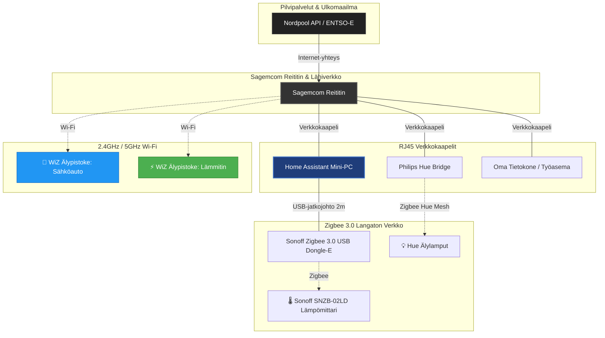
